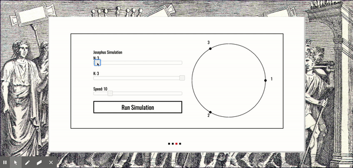
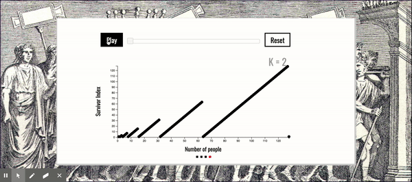
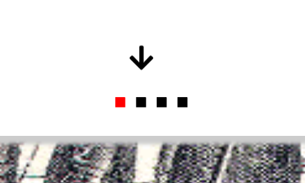

# JosephusSimulator
[live-site](https://josephus-sim.herokuapp.com/)


## Description

Josephus Sim is an algorithm visualizer for the famous [Josephus Problem](https://en.wikipedia.org/wiki/Josephus_problem). It provides background information, a visualizer that allows users to plug and play with different values, and an interactive chart plotting different values of k and n. Both the chart and simulator are built using D3.js.

## Technologies
* D3.js
* Vanilla Javascript
* JQuery and JQuery UI
* HTML
* CSS
* Heroku

## Some Features

### Simulator

Indices that get eliminated are produced using this solution:
```
function josephusSim(n,k) {
	let arr = [],
		eliminated = [];
	for (let i = 0; i < n; i++) {
		arr.push(i+1);
	}
	while (arr.length > 1) {
		let index = arr.indexOf(arr[(k-1)%(arr.length)]);
		eliminated.push(...arr.splice((k-1)%(arr.length), 1))
		for (let j = 0; j < index; j++) {
			arr.push(arr.shift());
		}
	}
	return eliminated;
}
```
Based on the slider values and some simple trig we generate the positions of the points on the large circle:
```
function pointsOnCircle(num){
    var angle = (2 * Math.PI)/num;
    var points = [];
    var i=0;
    for(var a = 0; a<(2*Math.PI); a+=angle){
        if (points.length === num) {
            break;
        }
        i++;
        points.push({
            x:Math.cos(a),
            y:Math.sin(a),
            rotation:a,
            label:'point' + i
        })
    }
    return points;
}
```
D3 then appends the circle SVG's an equal distance around the our circle:
```
function generateCircle(num) {
    let points = d3.selectAll('.point');
    let rects = d3.selectAll('.rect');
    let chords = d3.selectAll('.chord');
    chords.remove();
    points.remove();
    rects.remove();
    let circles = pointsOnCircle(num);
    // svgDoc.data(circles).enter()
    // mainCircle.call(pointCircle);
    circleGroup.append('circle')
            .attr('r', size/2)
            .attr('cx', size/2)
            .attr('cy', size/2)
            .attr('fill', 'none')
            .attr('stroke', 'black')
    circles.forEach((circle, i) => {
        circleGroup.append('circle')
            .attr('r', 5)
            .attr('cx', scale1(circle.x))
            .attr('cy', scale1(circle.y))
            .classed(`point`, true)
            .classed(`idx${i+1}`, true)
    })
    circleGroup.append('circle')
        .attr('r', size/1.75)
        .attr('cx', size/2)
        .attr('cy', size/2)
        .attr('fill', 'none')
        .attr('stroke', 'white')
    circles.forEach((circle, i) => {
        circleGroup.append('text')
            // .attr('r', 5)
            .attr('x', scale2(circle.x))
            .attr('y', scale2(circle.y))
            // .attr('fill', 'red')
            .classed('rect', true)
            .text(`${i+1}`)
    })
}
```
### Graphing Solution Values

Chart is built using a standard D3 workflow. First we establish the margins our D3 group will fit in and the height and width of our chart:
```
var margin = { left:80, right:20, top:50, bottom:100 };

var width = 700 - margin.left - margin.right,
	height = 400 - margin.top - margin.bottom;
```
Then we create a chart area, our axes, and scales: 
```
var g = d3.select("#chart-area")
    .append("svg")
        .attr("width", width + margin.left + margin.right)
        .attr("height", height + margin.top + margin.bottom)
    .append("g")
		.attr("transform", "translate(" + margin.left + ", " + margin.top + ")");

var xAxisGroup = g.append("g")
.attr("class", "x axis")
.attr("transform", "translate(0," + height +")");

var yAxisGroup = g.append("g")
	.attr("class", "y axis");
	
	...
	
var x = d3.scaleLinear()
	.range([0, width])

var y = d3.scaleLinear()
	.range([height, 0])
```
Then our render function generates the data and appends our points to the chart area:
```
function render() {
	
	// Generate data
	data = [{ 'values': [] }]
	for (let i = 0; i < 128; i++) {
		data[0]['values'].push({ 'n': i+1, 'jn': josephus(i+1, k), 'k': k })
	}
	// Set domains
	x.domain([0, 128])
	y.domain([0, 128])

	var xAxisCall = d3.axisBottom(x)
	xAxisGroup.call(xAxisCall);
	
	var yAxisCall = d3.axisLeft(y)
	yAxisGroup.call(yAxisCall);
	var circles = g.selectAll('circle')
		.data(data[0]['values'], function(d) {
			return d;
		})

	circles.exit().remove()
	circles.enter()
		.append('circle')
		.attr('fill', 'black')
		.attr('cy', function(d) { return y(d['jn']) })
		.attr('r', 5)
		.attr('cx', function(d) { return x(d['n']) })
		// .on("mouseover", tip.show)
		// .on("mouseout", tip.hide)
		.merge(circles)

	kLabel.text("K = " + k)
}
```
### Simple Slideshow

It would be overkill to involve another JS framework just for the sake of having dynamic web components for this applet. The slideshow feature is accomplished simply with CSS and JQuery. JQuery onClick functions add CSS classes that add/remove visibility of each div, and CSS transitions achieve the ease-in/ease-out transitions.

